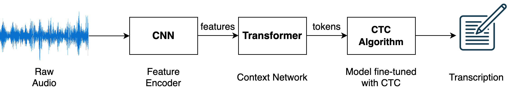

# How Does Pre-trained Wav2Vec 2.0 Perform on Domain Shifted ASR? An Extensive Benchmark on Air Traffic Control Communications 

<p align="center">
    <a href="https://github.com/idiap/w2v2-air-traffic/blob/master/LICENSE">
        
    </a>
    <a href="https://colab.research.google.com/github/idiap/w2v2-air-traffic/blob/main/src/eval_xlsr_atc_model.ipynb">
        
    </a>
    <a href="https://huggingface.co/Jzuluaga/wav2vec2-large-960h-lv60-self-en-atc-atcosim">
        
    </a>
    <a href="https://github.com/idiap/w2v2-air-traffic">
        
    </a>
    <a href="https://github.com/psf/black">
        
    </a>
</p>


Code for the paper [How Does Pre-trained Wav2Vec 2.0 Perform on Domain Shifted ASR? An Extensive Benchmark on Air Traffic Control Communications](https://arxiv.org/abs/2203.16822). To appear at [IEEE Spoken Language Technology Workshop (SLT 2022)](https://slt2022.org/)


<details>
  <summary markdown="span"><b>Recent work on self-supervised pre-training focus</b> on leveraging large-scale unlabeled speech data to build robust end-to-end (E2E)... </summary>

    acoustic models (AM) that can be later fine-tuned on downstream tasks
    e.g., automatic speech recognition (ASR). Yet, few works investigated the
    impact on performance when the data properties substantially differ between
    the pre-training and fine-tuning phases, termed domain shift. We target this
    scenario by analyzing the robustness of Wav2Vec 2.0 and XLS-R models on
    downstream ASR for a completely unseen domain, air traffic control (ATC)
    communications. We benchmark these two models on several open-source and
    challenging ATC databases with signal-to-noise ratio between 5 and 20 dB.
    Relative word error rate (WER) reductions between 20% to 40% are obtained in
    comparison to hybrid-based ASR baselines by only fine-tuning E2E acoustic
    models with a smaller fraction of labeled data. We analyze WERs on the
    low-resource scenario and gender bias carried by one ATC dataset.
</details>

<p align="center">
 <figure>
  
  <figcaption> Pipeline for fine-tuning an out-of-domain Wav2Vec 2.0 model on some audio data e.g., ATC-based audio data. (Figure taken from <a href="https://aws.amazon.com/blogs/machine-learning/fine-tune-and-deploy-a-wav2vec2-model-for-speech-recognition-with-hugging-face-and-amazon-sagemaker">this link</a>).
  </figcaption>
</figure> 
</p>


Models in HuggingFace: 

1) Finetuned [XLS-R-300m model](https://huggingface.co/facebook/wav2vec2-xls-r-300m) on ATCOSIM data: https://huggingface.co/Jzuluaga/wav2vec2-xls-r-300m-en-atc-atcosim
2) Finetuned [Wav2Vec2-Large-960h-Lv60 + Self-Training](https://huggingface.co/facebook/wav2vec2-large-960h-lv60-self) on ATCOSIM data: https://huggingface.co/Jzuluaga/wav2vec2-large-960h-lv60-self-en-atc-atcosim


**Repository written by**: [Juan Pablo Zuluaga](https://juanpzuluaga.github.io/).

---
## Table of Contents
- [Preparing Environment](#preparing-environment)
- [Usage](#usage)
    - [Download the Data](#download-the-data)
    - [Training one model](#training-one-model)
    - [Train baselines](#train-baselines)
    - [Train your LM with KenLM (optional)](#train-your-lm-with-kenlm-optional)
    - [Evaluate models (optional)](#evaluate-models-optional)
- [Related work](#related-work)
- [Cite us](#how-to-cite-us)


# Preparing Environment

The first step is to create your environment with the required packages for data preparation, formatting, and to carry out the experiments. You can run the following commands to create the conda environment (assuming CUDA - 11.7):

- Step 1: Using `python 3.10`: install python and the requirements

```bash
git clone https://github.com/idiap/w2v2-air-traffic
conda create -n w2v2_asr python==3.10
conda activate w2v2_asr
python -m pip install -r requirements.txt
```

Before running any script, make sure you have `en_US` locale set and `PYTHONPATH` in repository root folder.

```bash
export LANG=en_US.UTF-8 LC_ALL=en_US.UTF-8
export PYTHONPATH=$PYTHONPATH:$(pwd) #assuming you are in root repository folder
```

# Usage

There are several steps to replicate/use our proposed models:

## Out-of-the box model on HuggingFace

- You can use directly our model out-of-box by following the details here: https://huggingface.co/Jzuluaga/wav2vec2-xls-r-300m-en-atc-atcosim#writing-your-own-inference-script
- The model is trained on [ATCOSIM database](https://www.spsc.tugraz.at/databases-and-tools/atcosim-air-traffic-control-simulation-speech-corpus.html). The ATCOSIM dataset is already prepared in Datasets format here: https://huggingface.co/datasets/Jzuluaga/atcosim_corpus

**You can download the data prepared, filtered and ready to go** by doing:

```python
from datasets import load_dataset

DATASET_ID = "Jzuluaga/atcosim_corpus"

# Load the dataset
atcosim_corpus_train = load_dataset(DATASET_ID, "train", split="train")
atcosim_corpus_test = load_dataset(DATASET_ID, "test", split="test")
```

## Download the Data

For our experiments, we used 4 public databases and 3 private databases (see Table 1 on [paper](https://arxiv.org/abs/2203.16822)). We provide scripts to replicate some of the results **ONLY** for the public databases. 

Go to the data folder and follow the step-by-step process (very easy) in the [README file](data/README.md).

**TL;DR** (train a model with UWB-ATCC or ATCOSIM corpora, whicha are completly free):

- **Step 1**: download (1.2 GB) for free the UWB-ATCC CORPUS from: https://lindat.mff.cuni.cz/repository/xmlui/handle/11858/00-097C-0000-0001-CCA1-0

- **Step 2**: format and prepare the data for experimentation:

```bash
conda activate w2v2_asr
bash data/databases/uwb_atcc/data_prepare_uwb_atcc_corpus.sh
# or,
bash data/databases/uwb_atcc/data_prepare_atcosim_corpus.sh
```

-- The output folder should be in `experiments/data/uwb_atcc/{train,test}` -- 

## Training one model

Here, we describe how to train one model with the **UWB-ATCC**, which is **free!!!**

Most of the training and evaluation scripts are in the `src/` folder. The training procedure is very simple.

You can train a baseline model with **UWB-ATCC** by calling the high-level script:

```bash
bash ablations/uwb_atcc/train_w2v2_base.sh
```
That will train a [wav2vec2-base](https://huggingface.co/facebook/wav2vec2-base) model for 10k steps, with batch_size of 16 and grad accumularion of 2 (you can set it to 24 and 3,respectively, to train the model presented in the paper).

Also, you can modify some training hyper-parameters by calling [run_asr_fine_tuning.sh](src/run_asr_fine_tuning.sh) (which call internally `src/run_speech_recognition_ctc.py`) directly and passsing values from the CLI, e.g., `--per-device-train-batch-size 32` (instead of default=16), or use another encoder, `--model "facebook/wav2vec2-large-960h-lv60-self"`...

Another use case is to modify the training or evaluation data: 

- `--dataset-name "experiments/data/atcosim_corpus/train" `
-  `--eval-dataset-name "experiments/data/atcosim_corpus/test"`

The snippet of code below can be used for fine-tuning directly a model:

```bash
bash src/run_asr_fine_tuning.sh \
  --model-name-or-path "facebook/wav2vec2-large-960h-lv60-self" \
  --dataset-name "experiments/data/atcosim_corpus/train" \
  --eval-dataset-name "experiments/data/atcosim_corpus/test" \
  --max-steps "5000" \
  --per-device-train-batch-size "16" \
  --gradient-acc "4" \
  --learning_rate "5e-4" \
  --mask-time-prob "0.01" \
  --overwrite-dir "true" \
  --max-train-samples "1000" \
  --exp "experiments/results/baseline/"
```

This will train a `wav2vec2-large-960h-lv60-self` with ATCOSIM corpus for 5k steps and effective batch size of 16x4=64. Also, we only use 1000 samples, note the `--max-train-samples` parameter.

### Replicate Figure 1

- If you use `--max-train-samples xxxxx`, where `xxxxx` is the number of samples to use, you can easily replicate the Figure 1 plot in our [paper](https://arxiv.org/abs/2203.16822).

---
## Train baselines

We have prepared some scripts to replicate some baselines from our [paper](https://arxiv.org/abs/2203.16822). 

1) Script to train and evaluate the LDC-ATCC and UWB-ATCC results of Table 3 on [paper](https://arxiv.org/abs/2203.16822). Here, we only train and evaluate with the same model.

For UWB-ATCC:

```bash
bash ablations/uwb_atcc/train_w2v2_large-60v.sh
```

For LDC-ATCC:

```bash
bash ablations/ldc_atcc/train_w2v2_large-60v.sh
```

2) Script to train and evaluate models trained on ATCOSIM data, results of Table 4 on [paper](https://arxiv.org/abs/2203.16822).


This script below trains two models, one only with FEMALE recordings or only with MALE recordings:

```bash
bash ablations/atcosim/gender_train_w2v2_large-60v.sh
```

However, if you want to train a standalone model with all the training data, you can use:

```bash
# with wav2vec2-large-960h-lv60-self model, 
bash ablations/atcosim/train_w2v2_large-60v.sh
# or, with wav2vec2-xls-r-300m model, 
bash ablations/atcosim/train_w2v2_xlsr.sh
```

## Train your LM with KenLM (optional)

One part of our results (see Table 2 in the paper) uses LM during decoding to improve the WER. We followed the tutorial from HuggingFace: [Boosting Wav2Vec2 with n-grams in Transformers](https://huggingface.co/blog/wav2vec2-with-ngram). We prepared a very easy to follow script ([run_train_kenlm.sh](src/run_train_kenlm.sh)) to train 4-gram LMs which are latter added into the model.


### Install KenLM

You need to follow the document in [https://github.com/kpu/kenlm#compiling](https://github.com/kpu/kenlm#compiling).

### Train LM

You can train a 4-gram LM with [KenLM toolkit](https://github.com/kpu/kenlm) by simply running the following script (default dataset is `UWB-ATCC`).

```bash
bash src/run_train_kenlm.sh
```

If you want to train a LM for another corpus, you can simply pass input from CLI, like:

```bash
bash src/run_train_kenlm.sh \
    --dataset-name "atcosim_corpus" \
    --text-file "experiments/data/atcosim_corpus/train/text" \
    --n-gram-order "4"
```

That will train a 4-gram LM, using the transcript from `experiments/data/atcosim_corpus/train/text` and will write the resulting 4-gram LM in: `experiments/data/atcosim_corpus/train/lm/atcosim_corpus_4g.binary`.

**When this is done, you can move to `evaluation`**.

## Evaluate models (optional)

We have prepared one bash/python script to evaluate and perform inference with a defined model, e.g., train and evaluate on UWB-ATCC corpus:

- To get metrics:
```bash
bash src/run_eval_model.sh
```

Which is by default evaluating on UWB-ATCC corpus. The output should be generated on `/path/to/model/output/test_set_name`.

- **If you want to run the file for some other dataset**, you can call the python script directly: 

```bash
MODEL_FOLDER="experiments/results/baselines/wav2vec2-large-960h-lv60-self/atcosim/0.0ld_0.0ad_0.0attd_0.0fpd_0.0mtp_10mtl_0.0mfp_10mfl/checkpoint-10000"
LM_FOLDER="experiments/data/atcosim_corpus/train/lm/atcosim_corpus_4g.binary"

python3 src/eval_model.py \
    --language-model "$LM_FOLDER" \
    --pretrained-model "$MODEL_FOLDER" \
    --print-output "true" \
    --test-set "experiments/data/atcosim_corpus/test"
```

# Related work

Here is a list of papers that are somehow related to AI/ML targeted to Air traffic control communications:

- Fine-tuning a pretrained BERT model on the named entity recognition task to perform text-based diarization for ATC communications: 
    - paper: [BERTraffic: BERT-based Joint Speaker Role and Speaker Change Detection for Air Traffic Control Communications](https://arxiv.org/abs/2110.05781)
    - code: https://github.com/JuanPZuluaga/bert-text-diarization-atc

- How to use contextual data (biasing) in ATC automatic speech recognition:
    - Paper: [A two-step approach to leverage contextual data: speech recognition in air-traffic communications](https://arxiv.org/abs/2202.03725)
- ATCO2 corpus derived from the [ATCO2 project](https://www.atco2.org/): this is a extensive work describing how we collected more than 5000 hours of ATC communications. Later, we pre-transcribed it and trained ASR and NLP models for ATC communications:
    - paper: [ATCO2 corpus: A Large-Scale Dataset for Research on Automatic Speech Recognition and Natural Language Understanding of Air Traffic Control Communications](https://arxiv.org/abs/2211.04054)
    - code: https://github.com/idiap/atco2-corpus
- Ethics in collection ATC data: [Legal and Ethical Challenges in Recording Air Traffic Control Speech](https://aclanthology.org/2022.legal-1.14/)


Some other papers:

- [Boosting of contextual information in ASR for air-traffic call-sign recognition](http://www.fit.vutbr.cz/research/groups/speech/publi/2021/kocour21_interspeech.pdf)
- [Grammar Based Identification Of Speaker Role For Improving ATCO And Pilot ASR](https://arxiv.org/abs/2108.12175)
- [Contextual Semi-Supervised Learning: An Approach To Leverage Air-Surveillance and Untranscribed ATC Data in ASR Systems](https://arxiv.org/abs/2104.03643)
- [Automatic Processing Pipeline for Collecting and Annotating Air-Traffic Voice Communication Data](https://www.mdpi.com/2673-4591/13/1/8)
- [Automatic Call Sign Detection: Matching Air Surveillance Data with Air Traffic Spoken Communications](https://www.mdpi.com/2504-3900/59/1/14)
- [Improving callsign recognition with air-surveillance data in air-traffic communication](https://arxiv.org/abs/2108.12156)
- [Automatic Speech Recognition Benchmark for Air-Traffic Communications](https://arxiv.org/abs/2006.10304)


# How to cite us

If you use this code for your research, please cite our paper with:

Zuluaga-Gomez, J., Prasad, A., Nigmatulina, I., Sarfjoo, S., Motlicek, P., Kleinert, M., ... & Zhan, Q. (2022). How Does Pre-trained Wav2Vec2. 0 Perform on Domain Shifted ASR? An Extensive Benchmark on Air Traffic Control Communications. 2022 IEEE Spoken Language Technology Workshop (SLT), Doha, Qatar.

or use the bibtex item:

```
@article{zuluaga2022how,
    title={How Does Pre-trained Wav2Vec2. 0 Perform on Domain Shifted ASR? An Extensive Benchmark on Air Traffic Control Communications},
    author={Zuluaga-Gomez, Juan and Prasad, Amrutha and Nigmatulina, Iuliia and Sarfjoo, Saeed and Motlicek, Petr and Kleinert, Matthias and Helmke, Hartmut and Ohneiser, Oliver and Zhan, Qingran},
    journal={IEEE Spoken Language Technology Workshop (SLT), Doha, Qatar},
    year={2022}
  }
```
